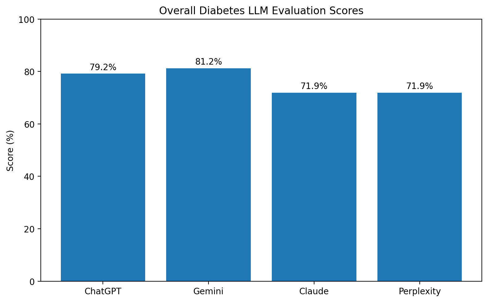
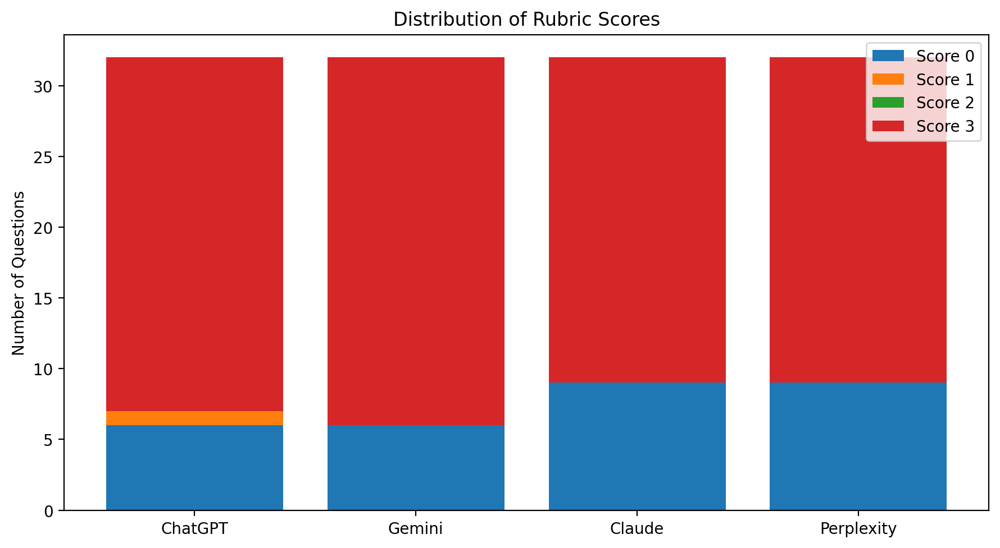

# LLM Evaluation on Diabetes Mellitus

A portfolio evaluation of four consumer AI assistants using a 32-question diabetes benchmark.

## Project Overview

A small, reproducible evaluation of four freely available consumer AI assistants—ChatGPT, Gemini, Claude, and Perplexity—on 32 diabetes mellitus questions grounded primarily in the American Diabetes Association Standards of Care in Diabetes—2026.

### Project objective

The project asks a practical question: How accurately do commonly available consumer AI assistants answer nuanced diabetes-related questions under ordinary user-facing conditions?

The evaluation focuses on clinically relevant reasoning, not just selection of a final option. Each response was compared with a predefined gold-standard answer and scored with a fixed rubric.

All systems were tested using freely available consumer interfaces. Logged-out access was used where available; where login was required, a free account was used. Web retrieval/search was permitted when available because the aim was to evaluate real-world product performance rather than isolated model knowledge.

### Evaluation design

, glycemic monitoring, pharmacotherapy, cardiovascular risk, hypertension, kidney disease, pregnancy-related lipid management, end-of-life care, and diabetes complications.

.

Explanations were limited to 80 words in the question set.

.

## Results

| AI System | Total Score | Maximum | Percentage |
|---|---:|---:|---:|
| ChatGPT | 76 | 96 | 79.17% |
| Gemini | 78 | 96 | 81.25% |
| Claude | 69 | 96 | 71.88% |
| Perplexity | 69 | 96 | 71.88% |

## Error Analysis

Representative failure modes are described in [ERROR_ANALYSIS.md](ERROR_ANALYSIS.md).

## Limitations

- The benchmark contains 32 questions and is intended as a focused portfolio evaluation rather than a comprehensive diabetes benchmark.
- The question author, gold-standard author, and primary scorer were the same evaluator, so independent expert validation and inter-rater reliability were not assessed.
- The 0-3 rubric rewards an additional relevant point at score 3; this can favor responses that provide useful extra detail.
- The study evaluates consumer AI assistants under the tested access conditions and time point. Product behavior may change as models, interfaces, retrieval systems, and defaults are updated.

## Conclusion

The four systems achieved broadly similar but non-identical performance, with Gemini obtaining the highest aggregate score, followed closely by ChatGPT, while Claude and Perplexity tied. The error analysis shows that aggregate accuracy alone is insufficient: clinically plausible reasoning, incomplete application of diagnostic criteria, task confusion, incomplete management, and internal contradictions were all observed. The project therefore demonstrates a practical workflow for domain-expert evaluation of medical AI outputs using a predefined benchmark, gold-standard answers, structured scoring, quantitative comparison, and qualitative error analysis.

## Repository Structure

- `METHODOLOGY.md` — evaluation design and testing conditions
- `RUBRIC.md` — scoring framework
- `RESULTS.md` — quantitative results
- `ERROR_ANALYSIS.md` — representative failure-mode analysis
- `analysis.py` — reproducible analysis script
- `original_documents/` — source Word documents and corrected master review
- `results/` — scored workbook and CSV files
- `figures/` — result visualizations

## Copyright Notice

© 2026 Dhananjay Tiwari. All rights reserved.

The 15 original case-based clinical reasoning questions included in this project are original works authored by Dhananjay Tiwari.

An application for copyright registration of **“Diabetes Mellitus Clinical Reasoning Benchmark: 15 Original Case Based Questions”** has been filed with the Copyright Office, Government of India.

**Copyright application:** Diary No. LD-37408/2026-CO  
**Filing date:** 10 August 2026

The clinical case questions may not be reproduced, redistributed, republished, or incorporated into another benchmark or evaluation dataset without permission. Copyright protection applies to the original expression and construction of the questions and does not restrict the underlying medical facts, concepts, or clinical guidelines.
